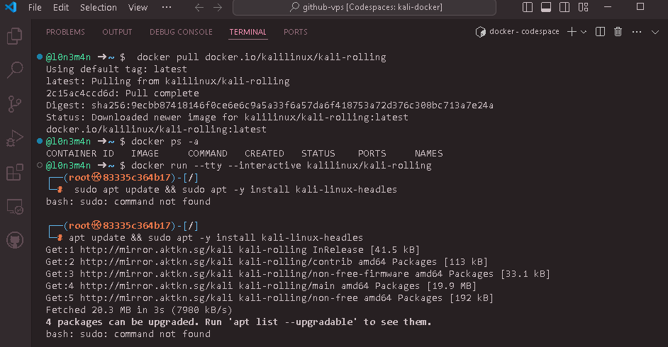

<div align="right">
  <a href="https://visitorbadge.io/status?path=https%3A%2F%2Fgithub.com%2Fl0n3m4n%2Fgithub-vps">
    
  </a>
</div>

# Github VPS  
## Free VPS via Github codespace (Ubuntu 22.04 AZURE) 


## 📜 Description 
GitHub Codespaces allows developers and hackers to create and utilize their coding environments directly from GitHub in the cloud. As a CTF player or pentester, you can also leverage GitHub Codespaces similarly to a VPS (Virtual Private Server). This makes it easy to work on projects from anywhere with the flexibility of a portable development setup using Docker.

## 📚 Table of Contents
- 🔥 [Whats Nice](#whats-nice)
- 🐳 [Installing Kali Linux Docker Images](#-kali-linux-docker-images)
- 🙍🏻‍♂️ [Adding non-root](#-adding-non-root-user)
- 🗃️ [Diskspace monitoring](#-diskspace-monitoring)
- 💎 [Docker Privileged](#-docker-privileged)
- 🖥️ [New Terminal Session](#-new-terminal-session)
- 🚫 [Temporarily Disabled](#-temporarily-disabled)
- 🔄 [Changelog](#-changelog)
- 💁 [References](#-references)
- 📌 [Author](#-author)
- 📊 [Github Status](#-github-status)
- 👨🏾‍⚖️ [License](#-license)

 
## 🔥 Whats Nice
- Offers more power with 2 vCPUs, 8 GB RAM, and a temporary 32GB SSD storage drive.
- Higher performance with 4 vCPUs, 16 GB RAM, and a temporary 32GB SSD storage drive.


### 🐳 Kali Linux Docker Images

> Assuming you already in the github codespace terminal
---

```bash
# pulling images 
kali@l0n3m4n:~$ docker pull docker.io/kalilinux/kali-rolling

# Option 1: Priviliged mode (recommended for ctf players)
kali@l0n3m4n:~$ docker run --privileged -it kalilinux/kali-rolling /bin/bash

# Option 2: Interactive mode
kali@l0n3m4n:~$ docker run --tty --interactive kalilinux/kali-rolling

# Option 1: (Recommended)
┌──(root㉿kali)-[~]
└─# apt update && apt install -y kali-linux-default

# Option 2: Installing metapackages
┌──(root㉿kali)-[~]
└─#  apt update && apt install -y install kali-linux-headless
```
### Step By Step Installation (Without error's)
Goto  for more details. 


### Starting Docker Kali Image
```bash
# Display current container
$ docker ps -a

# Rename docker name
$ docker rename <current_name> <new_name>

# Start kali image
$ docker start <container id> (e.q) d36922fa21e8

# Attach kali id
$ docker attach <container id>

# stop kali image
$ docker stop <container id>

# removing images
$ docker rm <container id>
```

## 🙍🏻‍♂️ Adding non-root user 

```bash
$ sudo apt update && sudo apt upgrade -y

# option 1:
$ adduser l0n3m4n

# option 2:
$ useradd -m -s /bin/bash l0n3m4n

# option 1: replace to your username
l0n3m4n ALL=(ALL:ALL) ALL

# option 2: 
$  echo "l0n3m4n ALL=(ALL) NOPASSWD:ALL" > /etc/sudoers/l0n3m4n

# switching to non-root user
$ su - l0n3m4n

# verify
$ whoami
$ sudo whoami
```

## 🗃️ Diskspace Monitoring 
```bash
# view ram details
$ free

# view disk space 'du'
$ du -h --max-depth=1 /

# view disk space GB
$ df -h

```

## 💎 Docker Privileged
> In order to use openvpn or enable `tun0` you need to add `--privileged` option instead using `--tty`
By default, Docker containers do not have access to TUN/TAP devices on the host system due to security and isolation concerns.
```bash
# options 1:
$ docker run --privileged -it kalilinux/kali-rolling /bin/bash

# Option 2: Use --device Flag (More Secure)
# A more secure approach is to use the --device flag to explicitly map the TUN/TAP device from the host into the # # # container. This approach is more controlled and limits access to only the necessary device.
$ docker run --device=/dev/net/tun:/dev/net/tun -it kalilinux/kali-rolling /bin/bash

# Verify TUN/TAP Functionality Inside the Container
$ ls -l /dev/net/tun
```

## 🖥️ New Terminal Session
> Assuming your in github codespace terminal
```bash
$ docker exec -it <container_id> /bin/bash

```

## 🚫 Temporarily Disabled 
If you've used 100% of the included services for GitHub Codespaces storage, a few things might happen depending on your account settings and actions:

1. Inability to Use Codespaces: You won't be able to create or use GitHub Codespaces until either your `free allotment resets next month` or you take action to manage your usage.
2. Options to Regain Access:
    - Set Up a Spending Limit: You can set up a `spending limit` on your GitHub account to prevent unexpected charges and manage your usage effectively.
    - Delete Unused Resources: Consider `deleting Codespaces` or `prebuilds` that are no longer needed to free up space and potentially reduce future charges.
    - Wait for Monthly Reset: If your account includes a free monthly allotment that `resets`, you may regain access to Codespaces once the reset occurs.
3. Access to In-Progress Work: It's important to `export` any unpushed work to a branch if you want to retain access to your in-progress projects. This ensures you have a backup and can continue working on them when you regain access to Codespaces.
4. Review Usage and Charges: GitHub provides a `usage report` where you can see detailed information about your Codespaces and prebuild usage. This can help you understand your usage patterns and manage future usage effectively.
---


## 🔄 Changelog
### v1.1.0 - [2024-06-29]
- Adjustment:
    - Adding `privileged` user mode to enable TUN error when starting the OpenVPN file.
      
## 💁 References
- [**docker image**](https://www.kali.org/docs/containers/using-kali-docker-images/) Kali Linux Docker image
- [**openvpn**](https://openvpn.net/) Openvpn client
## 📝 Todo
- [ ] **Remote vnc-viewer, rdesktop, xrdp, ssh, noVNC**
- [ ] **Adding Dockerfile**
- [ ] **ngrok expose cloud servers behind NATs and firewalls to the public internet over secure tunnels.**
- [ ] **Openvpn Configuration**


## 📌 Author
- [Facebook](https://facebook.com/l0n3m4n)
- [Twitter (X)](https://twitter.com/l0n3m4n)
- [Medium](https://medium.com/l0n3m4n)
- [Website](https://l0n3m4n.github.io)


## 📊 Github Status


## 👨🏾‍⚖️ License
This project is under terms of the [MIT License](LICENSE). For fixing Bugs, create [issue](https://github.com/l0n3m4n/github-vps/issues/new)
